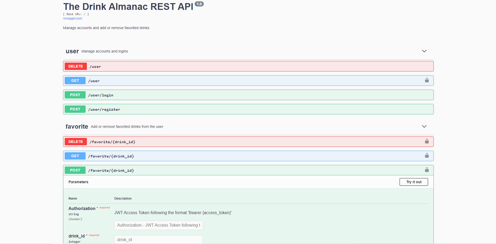

# The Drink Almanac API

Soon after moving into my new apartment in Chicago, I went out for drinks and paid way more than I wanted to for even the most basic cocktails. That's when I decided to make [TheDrinkAlmanac.com](https://thedrinkalmanac.com).

The Drink Almanac helps you save money on expensive drinks by showing you the ingredients and steps to make them yourself. If you like a drink and want to easily find it again, you can create a free account and favorite that drink. If you're in the mood to drink but don't have anything specific in mind, you can check out the 10 most popular drinks or cycle through some random ones until something catches your eye.

I created a REST API to allow users to easily create an account and save drinks for later. The documentation is automatically generated using Swagger and can be seen at [TheDrinkAlmanacAPI.herokuapp.com](https://thedrinkalmanacapi.herokuapp.com).

## Built With

- [Flask](https://flask.palletsprojects.com/en/2.0.x/) - Microframework used to create the REST API
- [Flask-RESTX](https://flask-restx.readthedocs.io/en/latest/index.html) - Flask extension used to create the API endpoints and models
- [Pytest](https://docs.pytest.org/en/6.2.x/) - Framework used to test the API
- [Heroku](https://www.heroku.com/about) - Platform as a Service used to serve the API
- [The Drink Almanac](https://thedrinkalmanac.herokuapp.com) - React Single-Page app that consumes this API  
  - GitHub repo [here](https://github.com/ryan-kp-miller/The-Drink-Almanac)

## Author's Info
- Portfolio - https://ryan-kp-miller.github.io
- Email - ryan.kp.miller@gmail.com